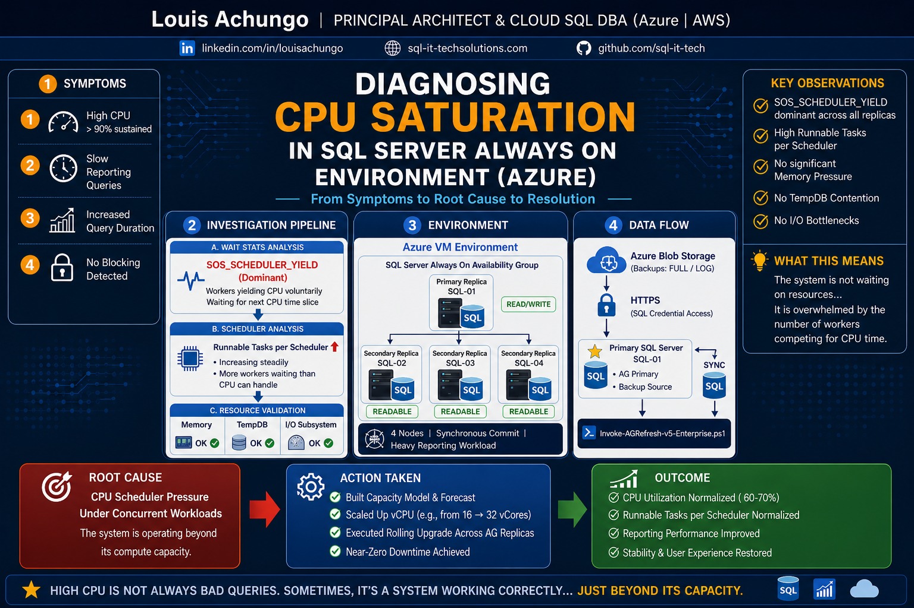

# 🚀 SQL Server CPU Saturation RCA
### Diagnosing Scheduler Pressure in Always On & High-Concurrency Environments

---

## 🏢 Case Study: Enterprise SQL Server Performance Engineering

This project is based on a real-world production scenario involving:

- 4-node SQL Server Always On Availability Group
- Azure VM deployment
- High-concurrency reporting workloads

The objective was to identify the root cause of sustained CPU saturation and implement a scalable solution without downtime.

---

## 🧠 Philosophy

> Don’t guess. Measure → Correlate → Prove → Act.

---

## 📊 Architecture Overview



---

## ⚡ Why This Matters

Most CPU issues are misdiagnosed.

This playbook demonstrates how to:

- Avoid guesswork
- Use SQL Server internals to identify bottlenecks
- Apply evidence-based scaling decisions

This is the difference between:

❌ Reactive troubleshooting  
✅ Performance engineering  

---

## 🔍 Problem Statement

High CPU in SQL Server is often misdiagnosed as:

- Bad queries  
- Missing indexes  
- General performance issues  

In enterprise environments, the real issue is often:

> 🔥 CPU Scheduler Pressure under concurrent workloads

---

## ⚠️ Key Signals

| Signal | Meaning |
|------|--------|
| SOS_SCHEDULER_YIELD | Workers yielding CPU time |
| High Runnable Tasks | CPU queue saturation |
| Low waits elsewhere | CPU is primary bottleneck |

---

## 🧪 Technical Analysis

### 1. Wait Stats Analysis

```sql
SELECT TOP 10 wait_type, wait_time_ms
FROM sys.dm_os_wait_stats
ORDER BY wait_time_ms DESC;
```

### 2. Scheduler Pressure

```sql
SELECT scheduler_id, runnable_tasks_count
FROM sys.dm_os_schedulers
WHERE status = 'VISIBLE ONLINE';
```

### 3. CPU Utilization

```sql
SELECT SQLProcessUtilization, SystemIdle
FROM sys.dm_os_ring_buffers
WHERE ring_buffer_type = 'RING_BUFFER_SCHEDULER_MONITOR';
```

### 4. Rule Out Other Bottlenecks

- Memory Grants Pending  
- TempDB contention  
- I/O latency  

---

## 🔥 Root Cause Identification

CPU saturation occurs when:

- Workers exceed scheduler capacity  
- Runnable queue builds up  
- CPU cannot service requests fast enough  

👉 The system is not blocked… it is overwhelmed

---

## 🚀 Engineering Solution

- Built capacity model  
- Scaled vCPU resources  
- Executed rolling upgrade across AG replicas  
- Validated post-change metrics  

---

## 📈 Outcome & Impact

- CPU stabilized (60–70%)  
- Runnable tasks normalized  
- Reporting performance improved  
- Near-zero downtime achieved  

---

## 🛠 Tools & Techniques

- SQL Server DMVs  
- Wait Statistics Analysis  
- Scheduler Queue Monitoring  
- Always On Architecture  
- Azure VM Scaling  

---

## 🎯 When to Use This Playbook

Use this approach when:

- CPU is consistently high (>80%)  
- Queries are slow but not blocked  
- No clear bottleneck exists  
- System is under concurrent load  

---

## 💡 Key Insight

> High CPU does not always mean inefficient queries.  
> Sometimes it means your system is operating correctly… just beyond its capacity.

---

## 🔗 Connect

- 🌐 Portfolio: https://sql-it-techsolutions.com/  
- 💼 LinkedIn: https://linkedin.com/in/louis-achungo  

---

⭐ If this helped, consider starring the repo.
